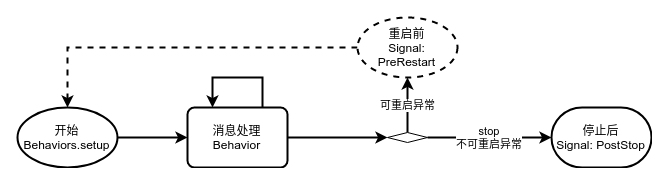

# Actor 生命周期

Akka Typed以函数式的方式构建，使用`Behavior[T]`函数的方式替代了经典（Untyped）Actor类的方式来创建actor。相应的，已没有了`preStart`、`postStop`、`preRestart`、`postRestart`等生命周期回调函数，采用`Behaviors.setup`构造块和信号的方式来实现一个actor生命周期管理功能。

Akka Typed actor生命周期已简化为4个部分：



1. 开始：通常将`Behaviors.receive`消息处理逻辑包装在`Behaviors.setup`代码块里，在`setup`代码块里进行业务初始工作，如：打开外部资源等
2. 消息处理：处理消息并返回下一个行为
3. 重启前：若设置了`SupervisorStrategy.restart`监管策略，则在actor被重启前将收到`PreRestart`信号，可在此选择对资源做同步或清理工作
4. 停止后：在actor被停止后，将收到`PostStop`信号，可在此做数据持久化和资源清理工作

@@@note
建议`PreRestart`和`PostStop`可执行相同的数据持久化和资源清理工作，这样在重新执行`Behaviors.setup`的构造逻辑时能和第一次创建actor时保持一致。这也更符合 **Let it crash** 精神！
@@@

@@snip [Lifecycle](../../../../../cookbook-actor/src/main/scala/cookbook/actor/lifecycle/Lifecycle.scala) { #Lifecycle }

下面是`Lifecycle`行为的测试代码：

@@snip [Lifecycle](../../../../../cookbook-actor/src/test/scala/cookbook/actor/lifecycle/LifecycleTest.scala) { #LifecycleTest }

运行测试输出如下（简化了部分输出内容）：

```
[19:43:10,971] [akka://LifecycleTest/user/$a] - actor started.
[19:43:10,972] [akka://LifecycleTest/user/$a] - Received message is hello
[19:43:11,970] [akka://LifecycleTest/user/$a] - Beginning restart.
[19:43:11,973] [akka://LifecycleTest/user/$a] - actor pre restart.
....
[19:43:11,977] [akka://LifecycleTest/user/$a] - actor started.
[19:43:13,009] [akka://LifecycleTest/user/$a] - actor post stop.
```