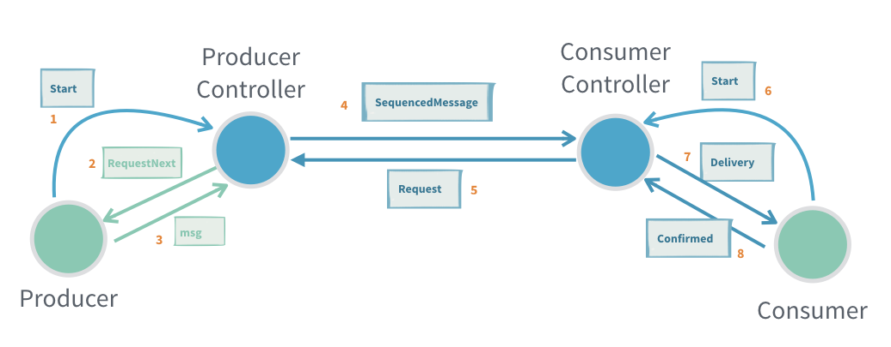
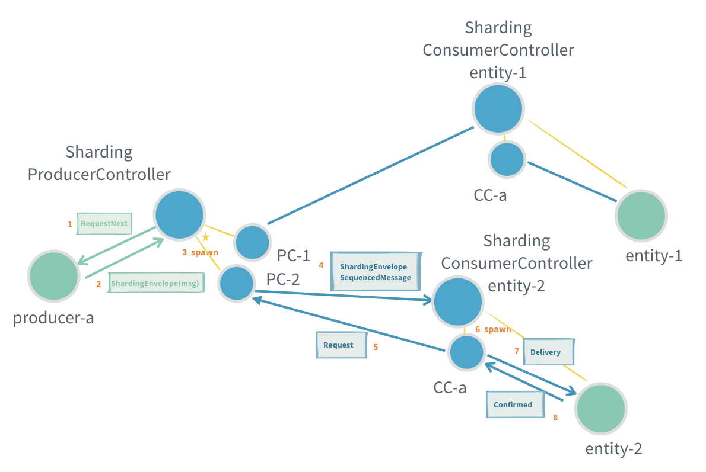
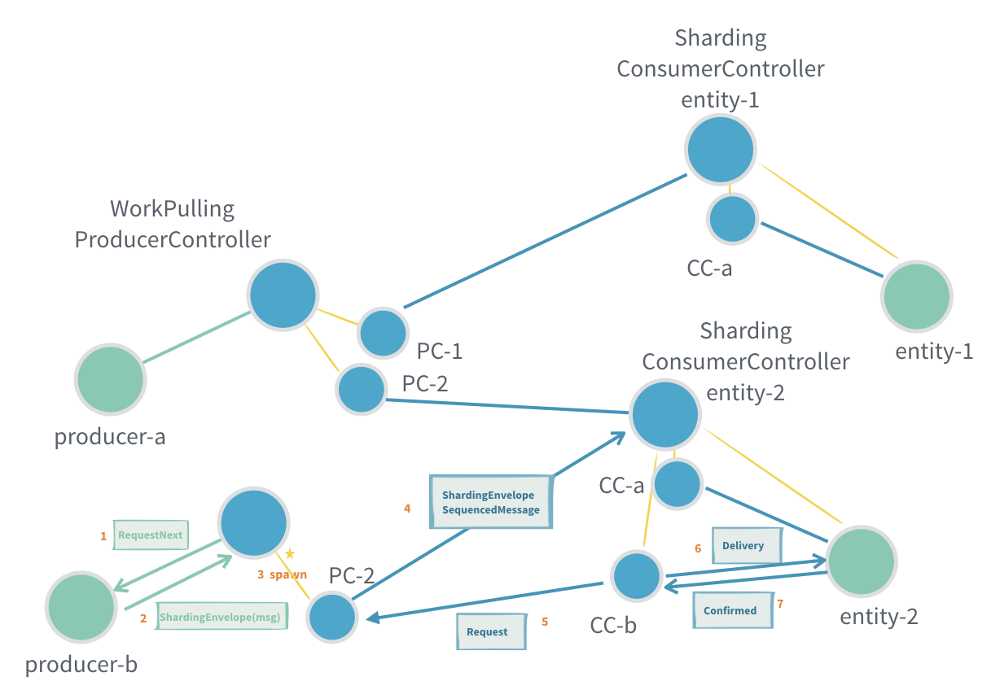

# 消息的可靠交付

Akka Actor 模型默认情况下是实现的最多一次交付，在本地环境发送消息还好，通常不会存在消息丢失的情况。但是在网络环境下，因为网络延迟等原因消息丢失的可能性大大增加。另外，发送端和接收端都有可能因为各种原因挂掉而造成消息丢失，无论本地还是跨网络环境。

通常，消息交付有三种方式： **至多一次** 、 **至少一次** 和 **恰好一次**。对于要求消息不能丢失的应用场景，第一种 **至多一次** 
的交付模式是肯定不可取的，那至少一次和恰好一次应该选择哪一种呢？对于 **恰好一次**，因为要保证一条消息不会被消费者消费多次，
那意味着生产者在向消费者发送消息之前需要先发送一条消息查询是否已被消费者使用过？而消费者在处理完消息向生产者发送确认（`Confirmed`）
消息后需要等待生产者返回 `ConfirmedAck` 消息，这无形中会显著增加系统消耗并降低吞吐量。最后来看一下 **至少一次**，
生产者在发送消息前不需要查询消费者是否已经处理过此条消息，消费者也不需要等待生产者返回 `ConfirmedAck`，这相对于 **恰好一次**
模式来说系统消耗将更小且吞吐量更高。 **至少一次** 造成的问题就是消费都可能会收到重复消息，但这在业务上可以简单地通过消息 ID 去重来解决。

总的来说， **至少一次** 对于大部分要求消息不能丢失的应用场景都是合适的，而 Akka Typed 提供的消息可靠交付也实现了这一方式。

Akka Typed 从 2.6.4 开始提供了可靠交付的 *预览* 版实现（相对于经典 actor 的至少一次交付实现），提供了三种支持的模式应用于不同的业务场景：

1. 点对点：两个 Actor 之间直接发送消息
2. 工作拉取（Work Pulling）：一个生产者 Actor 产生消息，多个消费者 Actor 消费消息（一个消息只被一个工作节点消费）
3. 分片（Sharding）：基于 Akka Cluster Sharding 机制在集群上自动分布 Actor，不需要手动管理 Actor 的创建、重启等工作

要使用可靠交付，需要添加下面依赖到项目：

```sbt
libraryDependencies += "com.typesafe.akka" %% "akka-actor-typed" % "2.6.4"
```

## 点对点可靠交付

Akka Typed 为点对点可靠交付抽像了生产者和消费者概念，生产者将消息发送到 `ProducerController` ，消费者通过 `ConsumerController`
接收消息。点对点可靠交付实现了至少一次交付，消费者端可能会收到重复数据。



生产者需要向 `ProducerController` 发送 `Start` （1）消息来启动它，这时生产者将收到一个 `RequestNext` （2）消息，
并可通过它向 `ProducerController` （3）发送消息。生产者只应在收到 `RequestNext` 消息时才向 `ProducerController` 发送消息，
这意味着两个 actor 之间的消息交付是一种消费者来主动拉的模式。

消费者也需要向 `ConsumerController` 发送 `Start` （6）消息来启动它，之后当消息可用时消费者会收到 `Delivery` （7）消息，
消费者应在消息处理完成后向生产者发送 `Confirmed` （8）来确认这条消息已经处理完成。若当前消息未被确认（`ProducerController` 收到
`Confirmed` 消息），消费者将不会收到下一条消息。

上图中 (4)、(5) 两个步骤将由 Akka 自动维护，开发人员不需要关心。当 `ConsumerController` 没有消息可用时它将向 `ProducerController`
发送 `Request` 消息请求获得消息。`ProducerController` 除了在收到 `Request` 请求之外，当发现还有未确认消息时也会主动向
`ConsumerController` 推送消息，比如从错误中恢复或者某个消息长时间未收到 `Confirmed` 确认而触发超时重发。
因为点对点可靠交付的流量控制是消费者（`ConsumerController`）控制的，这意味着生产者将不能发送比消费者处理能力更多的消息。

*注意：生产者和 `ProducerController`，以及消费者和 `ConsumerController` 必须在同一个 ActorSystem 中，不能跨网络。*

### 点对点可靠交付示例

示例以一个斐波那契数列计算做为示例，它有一个生产者计算从1开始到1000的斐波那契数例，消费者每次请求一个数字对应的斐波那契数值。

**生产者**

```scala
import akka.actor.typed.ActorRef
import akka.actor.typed.Behavior
import akka.actor.typed.delivery.ProducerController
import akka.actor.typed.scaladsl.Behaviors

object FibonacciProducer {
  sealed trait Command

  private case class WrappedRequestNext(r: ProducerController.RequestNext[FibonacciConsumer.Command]) extends Command

  def apply(
      producerController: ActorRef[ProducerController.Command[FibonacciConsumer.Command]]): Behavior[Command] = {
    Behaviors.setup { context =>
      val requestNextAdapter =
        context.messageAdapter[ProducerController.RequestNext[FibonacciConsumer.Command]](WrappedRequestNext(_))
      producerController ! ProducerController.Start(requestNextAdapter)

      fibonacci(0, 1, 0)
    }
  }

  private def fibonacci(n: Long, b: BigInt, a: BigInt): Behavior[Command] = {
    Behaviors.receive {
      case (context, WrappedRequestNext(next)) =>
        context.log.info("Generated fibonacci {}: {}", n, a)
        next.sendNextTo ! FibonacciConsumer.FibonacciNumber(n, a)

        if (n == 1000)
          Behaviors.stopped
        else
          fibonacci(n + 1, a + b, b)
    }
  }
}
```

有关 Akka Typed 消息适配（`context.messageAdapter`）的更多内容可以参看 [适配响应类型到 Actor](https://www.yangbajing.me/akka-cookbook/actor/pattern/adapted-response.html) 。

**消费者**

```scala
import akka.actor.typed.delivery.ConsumerController

object FibonacciConsumer {
  sealed trait Command

  final case class FibonacciNumber(n: Long, value: BigInt) extends Command

  private case class WrappedDelivery(d: ConsumerController.Delivery[Command]) extends Command

  def apply(
      consumerController: ActorRef[ConsumerController.Command[FibonacciConsumer.Command]]): Behavior[Command] = {
    Behaviors.setup { context =>
      val deliveryAdapter =
        context.messageAdapter[ConsumerController.Delivery[FibonacciConsumer.Command]](WrappedDelivery(_))
      consumerController ! ConsumerController.Start(deliveryAdapter)

      Behaviors.receiveMessagePartial {
        case WrappedDelivery(ConsumerController.Delivery(FibonacciNumber(n, value), confirmTo)) =>
          context.log.info("Processed fibonacci {}: {}", n, value)
          confirmTo ! ConsumerController.Confirmed
          Behaviors.same
      }
    }
  }
}
```

通过向 `confirmTo` 发送 `ConsumerController.Confirmed` 消息，`ConsumerController` 将向生产者发送消息（处理）确认。
`ConsumerController` 内部隐藏了消息ID等技术细节，开发人员不需要关心应该发送哪条消息的确认消息，这简化了 API，同时可以让代码更专注于业务逻辑。

下面代码构造了生产者、消费者以及它们分别需要的 `ProducerController` 和 `ConsumerController`。将生产者和消费者连接起来是通过将
`producerController` 作为 `RegisterToProducerController` 消息的内容发送到 `consumerController` 来实现的，`consumerController`
内部会实现 `ProducerController` 和 `ConsumerController` 的连接。

```scala
val consumerController = context.spawn(ConsumerController[FibonacciConsumer.Command](), "consumerController")
context.spawn(FibonacciConsumer(consumerController), "consumer")

val producerId = s"fibonacci-${UUID.randomUUID()}"
val producerController = context.spawn(
  ProducerController[FibonacciConsumer.Command](producerId, durableQueueBehavior = None),
  "producerController")
context.spawn(FibonacciProducer(producerController), "producer")

consumerController ! ConsumerController.RegisterToProducerController(producerController)
```

### 点对点交付语义

只要生产者和消费者都没崩溃，消息就会按发送到 `ProducerController` 的顺序发送到消费者，不会丢失也不会重复。这意味着就是恰好一次处理，
消费者端不需要任何业务级的重复判断。

如果生产者崩溃，那么未确认的消费可能会丢失。为了防止消息丢失可以启用 `ProducerController` 的 `durableQueueBehavior` ，
这将在生产者端启用持久化存储，通过 Akka Persistence 把未确认消息存储到外部物理存储上，这样在从崩溃中恢复以后可以继续处理未确认消息。
这意味着至少一次交付。

如果消费者崩溃，那么一个新的 `ConsumerController` 可以连接到消费者。生产者将重新传递所有未确认的消息，这样消费者可能需要根据消息 ID 
来判断此消息是否被处理过。这意味着至少一次交付。

## 工作拉取（Work Pulling）

工作拉取模式在点对点交付的基础之上提供了一对多的消息通信方式。工作拉取指多个消费者按照自己的节奏从同一个生产者拉取消息，
而生产者并不在意有多次个消费者，也不会在不知道消费者处理能力的情况下盲目的向消费者推送消息。

这里一个重要的特性是消息处理的顺序是不确定的，消息将被随机的发送到各个消费者，甚至未确认的消息在重发时也可能发送到不同的消费者上。

消息从生产者发送到 `WorkPullingProducerController` ，并通过 `ConsumerController` 到达消费者 actor。
消费者的处理逻辑对点对点交付模式中消费者处理逻辑一样。下图是一个消费者时的工作拉取模式：


下面是有两个消费者时的工作拉取模式：


消费者的 `ConsumerController` 通过 [`ServiceKey`](https://doc.akka.io/docs/akka/current/typed/actor-discovery.html)
动态注册到 `WorkPullingProducerController`。通过这个方式，消费者可以动态注册或删除自己到/从相同 `ServiceKey` 的生产者。

与点对点交付模式类似，式作拉取模式也是客户端主动拉取的，生产者需要在收到 `Request` 请求以后才能向 `WorkPullingProducerController` 
发送消息。生产者与 `WorkPullingProducerController` 也要在同一个 ActorSystem 中，不允许跨网络，消费者亦同。生产者和消费者都需要向
`XxxController` 发送 `Start` 消息来启动它；消费者同样需要向 `confirmTo` 发送 `ConsumerController.Confirmed` 消费来告知生产者此消息
已被消费。因为生产者与多个消费者之间的流量控制由消费者驱动，意味着生产者发送的速度不会快于消费者的请求速度。

不同的地方在当多个消费者向生产者请求消息，在消息被实际发送到消费者之前消费者已经停止。这时，消息将被缓冲在生产者端，当有新的消费者注册或请求时，
缓冲的消息将被发送到消费者。

### 工作拉取示例

**图片转换消费者（Worker）**

与点对点交付模式不同，工作拉取模式下 `ConsumerController` 不再是通过发送 `ConsumerController.RegisterToProducerController(producerController)` 
注册消息的方式来注册到 `WorkPullingProducerController` 的，而是在构造 `ConsumerController` 时通过
[`ServiceKey`](https://doc.akka.io/docs/akka/current/typed/actor-discovery.html) 来查找生产者。 

```scala
import akka.actor.typed.delivery.ConsumerController
import akka.actor.typed.receptionist.ServiceKey

object ImageConverter {
  sealed trait Command
  final case class ConversionJob(resultId: UUID, fromFormat: String, toFormat: String, image: Array[Byte])
  private case class WrappedDelivery(d: ConsumerController.Delivery[ConversionJob]) extends Command

  val serviceKey = ServiceKey[ConsumerController.Command[ConversionJob]]("ImageConverter")

  def apply(): Behavior[Command] = {
    Behaviors.setup { context =>
      val deliveryAdapter =
        context.messageAdapter[ConsumerController.Delivery[ConversionJob]](WrappedDelivery(_))
      val consumerController =
        context.spawn(ConsumerController(serviceKey), "consumerController")
      consumerController ! ConsumerController.Start(deliveryAdapter)

      Behaviors.receiveMessage {
        case WrappedDelivery(delivery) =>
          val image = delivery.message.image
          val fromFormat = delivery.message.fromFormat
          val toFormat = delivery.message.toFormat
          // convert image...
          // store result with resultId key for later retrieval

          // and when completed confirm
          delivery.confirmTo ! ConsumerController.Confirmed

          Behaviors.same
      }

    }
  }

}
```

**图片转换生产者**

`WorkPullingProducerController` 在构造时需要指定 `ServiceKey`，消费者同过相同的 `ServiceKey` 注册到生产者。

```scala
import akka.actor.typed.delivery.WorkPullingProducerController

object ImageWorkManager {
  trait Command
  final case class Convert(fromFormat: String, toFormat: String, image: Array[Byte]) extends Command
  private case class WrappedRequestNext(r: WorkPullingProducerController.RequestNext[ImageConverter.ConversionJob])
      extends Command

  final case class GetResult(resultId: UUID, replyTo: ActorRef[Option[Array[Byte]]]) extends Command

  def apply(): Behavior[Command] = {
    Behaviors.setup { context =>
      val requestNextAdapter =
        context.messageAdapter[WorkPullingProducerController.RequestNext[ImageConverter.ConversionJob]](
          WrappedRequestNext(_))
      val producerController = context.spawn(
        WorkPullingProducerController(
          producerId = "workManager",
          workerServiceKey = ImageConverter.serviceKey,
          durableQueueBehavior = None),
        "producerController")
      producerController ! WorkPullingProducerController.Start(requestNextAdapter)

      Behaviors.withStash(1000) { stashBuffer =>
        new ImageWorkManager(context, stashBuffer).waitForNext()
      }
    }
  }

}

final class ImageWorkManager(
    context: ActorContext[ImageWorkManager.Command],
    stashBuffer: StashBuffer[ImageWorkManager.Command]) {

  import ImageWorkManager._

  private def waitForNext(): Behavior[Command] = {
    Behaviors.receiveMessage {
      case WrappedRequestNext(next) =>
        stashBuffer.unstashAll(active(next))
      case c: Convert =>
        if (stashBuffer.isFull) {
          context.log.warn("Too many Convert requests.")
          Behaviors.same
        } else {
          stashBuffer.stash(c)
          Behaviors.same
        }
      case GetResult(resultId, replyTo) =>
        // TODO retrieve the stored result and reply
        Behaviors.same
    }
  }

  private def active(
      next: WorkPullingProducerController.RequestNext[ImageConverter.ConversionJob]): Behavior[Command] = {
    Behaviors.receiveMessage {
      case Convert(from, to, image) =>
        val resultId = UUID.randomUUID()
        next.sendNextTo ! ImageConverter.ConversionJob(resultId, from, to, image)
        waitForNext()
      case GetResult(resultId, replyTo) =>
        // TODO retrieve the stored result and reply
        Behaviors.same
      case _: WrappedRequestNext =>
        throw new IllegalStateException("Unexpected RequestNext")
    }
  }
}
```

### 工作拉取语义

工作拉取模式不关心消息顺序，因为每个消息会被随机的以任一路由到任何一个消费者。

只要生产者和消费者不崩溃（或因为某种原因消费者被删除），消息就会被传递到消费者，不会丢失也不会重复，不需要任何业务层面的重复判断。
这意味着至少一次交付。

如果生产者崩溃，那么未确认的消费可能会丢失。为了防止消息丢失可以启用 `WorkPullingProducerController` 的 `durableQueueBehavior` ，
这将在生产者端启用持久化存储，通过 Akka Persistence 把未确认消息存储到外部物理存储上，这样在从崩溃中恢复以后可以继续处理未确认消息。
这意味着至少一次交付。

如果消费者崩溃或被停止，未确认消息将被重新传递到其它消费者。这种情况下，消息可能已经被处理过了，收到消息的消费者可能需要根据消息 ID 去重。
这意味着至少一次交付。

## 分片（Sharding）

与 Akka Cluster Sharding 一起使用可靠交付，需要添加下面依赖到项目：

```sbt
libraryDependencies += "com.typesafe.akka" %% "akka-cluster-sharding-typed" % "2.6.4"
```

通过分片方式的生产者和消费者之间的消息可靠交付：


发送消息到另一个消费者：



从另一个生产者发送消息到消费者：



`ShardingProducerController` 应与 `ShardingConsumerController` 一起使用。

生产者可以通过 `ShardingProducerController` 发送消息到指定 `entityId` 的 `ShardingConsumerController`。每个 `ActorSystem`（节点）
的单个 `ShardingProducerController` 都可以发送消息到相同实体类型（`EntityTypeKey`）的所有消费者实体，不需要显示的注册
`ShardingConsumerController` 到 `ShardingProducerController`。

在 `ShardingProducerController.RequestNext` 消息中，有关于哪些实体在请求数据的信息。但是，它也允许向未包含在
`RequestNext.entitiesWithDemand` 里的新 `entityId` 发送消息，这时候这些消息将被缓冲。这意味着，可以一次向 `RequestNext`
发送多条消息，但建议每次只发送一条，等待下一个 `RequestNext` 到来后再发送其它消息。

生产者与 `ShardingProducerController` 也必须在同一个 `ActorSystem` 系统，并且不能跨网络。

每个分片实体都有一个 `ShardingConsumerController`，它与 `ShardingProducerController` 之间可以有很多未确认的消息，
但受到由消费者驱动流量控制，这意味着 `ShardingProducerController` 的发送速度不会超过消费者需求的速度。

### 分片示例

分片实体是一个 todo list 应用，它使用异步数据库调用存储自己在每次变化时的整个状态，当存储完成时首先把 `confirmTo` 与存储结果一起发送给 actor 自己，
再根据存储结果类型向生产者发送 `Confirmed` 确认消息。

**消费者 `TodoList` 实体**

```scala
trait DB {
  def save(id: String, value: TodoList.State): Future[Done]
  def load(id: String): Future[TodoList.State]
}

object TodoList {

  sealed trait Command

  final case class AddTask(item: String) extends Command
  final case class CompleteTask(item: String) extends Command

  private final case class InitialState(state: State) extends Command
  private final case class SaveSuccess(confirmTo: ActorRef[ConsumerController.Confirmed]) extends Command
  private final case class DBError(cause: Throwable) extends Command

  private final case class CommandDelivery(command: Command, confirmTo: ActorRef[ConsumerController.Confirmed])
      extends Command

  final case class State(tasks: Vector[String])

  def apply(
      id: String,
      db: DB,
      consumerController: ActorRef[ConsumerController.Start[Command]]): Behavior[Command] = {
    Behaviors.setup[Command] { context =>
      new TodoList(context, id, db).start(consumerController)
    }
  }

}

class TodoList(context: ActorContext[TodoList.Command], id: String, db: DB) {
  import TodoList._

  private def start(consumerController: ActorRef[ConsumerController.Start[Command]]): Behavior[Command] = {
    context.pipeToSelf(db.load(id)) {
      case Success(value) => InitialState(value)
      case Failure(cause) => DBError(cause)
    }

    Behaviors.receiveMessagePartial {
      case InitialState(state) =>
        val deliveryAdapter: ActorRef[ConsumerController.Delivery[Command]] = context.messageAdapter { delivery =>
          CommandDelivery(delivery.message, delivery.confirmTo)
        }
        consumerController ! ConsumerController.Start(deliveryAdapter)
        active(state)
      case DBError(cause) =>
        throw cause
    }
  }

  private def active(state: State): Behavior[Command] = {
    Behaviors.receiveMessagePartial {
      case CommandDelivery(AddTask(item), confirmTo) =>
        val newState = state.copy(tasks = state.tasks :+ item)
        save(newState, confirmTo)
        active(newState)
      case CommandDelivery(CompleteTask(item), confirmTo) =>
        val newState = state.copy(tasks = state.tasks.filterNot(_ == item))
        save(newState, confirmTo)
        active(newState)
      case SaveSuccess(confirmTo) =>
        confirmTo ! ConsumerController.Confirmed
        Behaviors.same
      case DBError(cause) =>
        throw cause
    }
  }

  private def save(newState: State, confirmTo: ActorRef[ConsumerController.Confirmed]): Unit = {
    context.pipeToSelf(db.save(id, newState)) {
      case Success(_)     => SaveSuccess(confirmTo)
      case Failure(cause) => DBError(cause)
    }
  }
}
```

注意：通过 Cluster Sharding 启动的 TodoList 需要通过发送消息（`consumerController ! ConsumerController.Start(deliveryAdapter)`）
来手动启动 `ConsumerController` 。

`TodoService` 生产者：

```scala
object TodoService {
  sealed trait Command

  final case class UpdateTodo(listId: String, item: String, completed: Boolean, replyTo: ActorRef[Response])
      extends Command

  sealed trait Response
  case object Accepted extends Response
  case object Rejected extends Response
  case object MaybeAccepted extends Response

  private final case class WrappedRequestNext(requestNext: ShardingProducerController.RequestNext[TodoList.Command])
      extends Command
  private final case class Confirmed(originalReplyTo: ActorRef[Response]) extends Command
  private final case class TimedOut(originalReplyTo: ActorRef[Response]) extends Command

  def apply(producerController: ActorRef[ShardingProducerController.Command[TodoList.Command]]): Behavior[Command] = {
    Behaviors.setup { context =>
      new TodoService(context).start(producerController)
    }
  }

}

class TodoService(context: ActorContext[TodoService.Command]) {
  import TodoService._

  private implicit val askTimeout: Timeout = 5.seconds

  private def start(
      producerController: ActorRef[ShardingProducerController.Start[TodoList.Command]]): Behavior[Command] = {
    val requestNextAdapter: ActorRef[ShardingProducerController.RequestNext[TodoList.Command]] =
      context.messageAdapter(WrappedRequestNext.apply)
    producerController ! ShardingProducerController.Start(requestNextAdapter)

    Behaviors.receiveMessagePartial {
      case WrappedRequestNext(next) =>
        active(next)
      case UpdateTodo(_, _, _, replyTo) =>
        // not hooked up with shardingProducerController yet
        replyTo ! Rejected
        Behaviors.same
    }
  }

  private def active(requestNext: ShardingProducerController.RequestNext[TodoList.Command]): Behavior[Command] = {
    Behaviors.receiveMessage {
      case WrappedRequestNext(next) =>
        active(next)

      case UpdateTodo(listId, item, completed, replyTo) =>
        if (requestNext.bufferedForEntitiesWithoutDemand.getOrElse(listId, 0) >= 100)
          replyTo ! Rejected
        else {
          val requestMsg = if (completed) TodoList.CompleteTask(item) else TodoList.AddTask(item)
          context.ask[ShardingProducerController.MessageWithConfirmation[TodoList.Command], Done](
            requestNext.askNextTo,
            askReplyTo => ShardingProducerController.MessageWithConfirmation(listId, requestMsg, askReplyTo)) {
            case Success(Done) => Confirmed(replyTo)
            case Failure(_)    => TimedOut(replyTo)
          }
        }
        Behaviors.same

      case Confirmed(originalReplyTo) =>
        originalReplyTo ! Accepted
        Behaviors.same

      case TimedOut(originalReplyTo) =>
        originalReplyTo ! MaybeAccepted
        Behaviors.same
    }
  }

}
```

通过 ActorSystem 的守卫 actor 实例化 TodoList 服务的分片生产者和分片消费者。`ShardingConsumerController`
内部包含了 `ConsumerController`，通过在构造分片实体的时候传递给 `TodoList` actor。

```scala
object ToDoApp {
  private val entityTypeKey = EntityTypeKey[ConsumerController.SequencedMessage[TodoList.Command]]("toto")

  private def behavior(db: DB): Behavior[TodoList.Command] = Behaviors.setup { context =>
    val todoEntity = Entity(entityTypeKey)(entityContext =>
      ShardingConsumerController(start => TodoList(entityContext.entityId, db, start)))
    val todoRegion = ClusterSharding(context.system).init(todoEntity)
    val selfAddress = Cluster(context.system).selfMember.address
    val producerId = s"todo-producer-${selfAddress.host}:${selfAddress.port}"
    val producerController =
      context.spawn(ShardingProducerController(producerId, todoRegion, None), "producerController")

    context.spawn(TodoService(producerController), "producer")

    Behaviors.ignore
  }

  def main(args: Array[String]): Unit = {
    val db = new DB {
      override def save(id: String, value: TodoList.State): Future[Done] = ???
      override def load(id: String): Future[TodoList.State] = ???
    }
    ActorSystem(behavior(db), "todo-system")
  }
}
```

### 分片交付语义

只要生产者和消费者都没崩溃，消息就会按发送到 `ShardingProducerController` 的顺序发送，不会丢失也不会重复。这意味着就是恰好一次处理，
消费者端不需要任何业务级的重复判断。

如果生产者崩溃，那么未确认消息可能丢失。为了防止消息丢失可以启用 `ShardingProducerController` 的 `durableQueueBehavior`，
这将在生产者端启用持久化存储，通过 Akka Persistence 把未确认消息存储到外部物理存储上，这样在从崩溃中恢复以后可以继续处理未确认消息。
这意味着至少一次交付。

如果消费者崩溃或分片被重新平衡，那么将重新传送未确认消息。这种情况下也许会重复处理前一个消费者已经处理过的消息。

## 持久的生产者

生产者在收到确认消息之前，相应的消息会一直保存在内存里以用于可能的重发。但是，如果生产者端的 JVM 崩溃，那么未确认消息将会丢失。
`DurableProducerQueue` 可用于确保消息在这种场景（JVM 崩溃）下也可以交付。因为未确认消息以持久的方式被存储，所以当生产者重启以后可以重新传送它们。
`EventSourcedProducerQueue` 是 `akka-persistence-typed` 提供的 `DurableProducerQueue` 实现。

***注意，`DurableProducerQueueue` 将增加大量的性能开销。***

要使用 `EventSourcedProducerQueue`，需要添加下面的依赖：

```sbt
libraryDependencies += "com.typesafe.akka" %% "akka-persistence-typed" % "2.6.4"
```

要使用 `EventSourcedProducerQueue` 非常简单，比如前面的图片转换示例，可以按下面代码描述使用：

```scala
import akka.persistence.typed.delivery.EventSourcedProducerQueue
import akka.persistence.typed.PersistenceId

val durableQueue =
  EventSourcedProducerQueue[ImageConverter.ConversionJob](PersistenceId.ofUniqueId("ImageWorkManager"))
val durableProducerController = context.spawn(
  WorkPullingProducerController(
    producerId = "workManager",
    workerServiceKey = ImageConverter.serviceKey,
    durableQueueBehavior = Some(durableQueue)),
  "producerController")
```

可以看到，只需要在构建 `WorkPullingProducerController` 时传递一个 `EventSourcedProducerQueue` 的实例即可。 *需要注意的是，务必确保
`PersistenceId` 的唯一性。*

## 只有流量控制

可以不重发丢失的消息，但仍然使用流量控制。当生产者和消息者都在相同的本地 ActorSystem 上时，这可能有用。这样做会更高效，
因为在确认之前消息不必被保存在 `ProducerController` 的内存中，但缺点是丢失的消息将不被重传。可以参考 `ConsumerController` 的
[`only-flow-control`](https://doc.akka.io/docs/akka/current/general/configuration-reference.html#akka-actor-typed) 配置。

## 总结

Akka Typed 在版本 2.6.4 开始终于提供了可靠交付的实现（之前只有经典、非类型 actor 版本的实现）：至少一次交付（At Least Once Delivery）。
可以看到，提供了可靠交付实现是基于 Akka 已有功能之上的，比如：

- 通过 `Receptionist` 根据 `ServiceKey` 查找远程 actor；
- 通过 Akka Cluster Sharding 实现基于分片的可靠交付，这样就不需要手动管理消费者的创建；
- 通过 Akka Persistence 可现了未确认消息的持久存储，以保证在程序重启后仍然可以重发未确认消息。

对于 Akka Typed 现在提供的各种可靠交付模式，各有各的实现方式，下面列出各自的适用场景：

| 交互模式 | 传输方式 | 流量控制 | 未确认消息持久化 | 适用场景 |
| ------- | ------- | ------ | ------------- | ------ |
| 点对点   | 消费者拉 | 有      | 支持          | 两个 actor 之间发送消息 |
| 工作拉取 | 消费者拉 | 有      | 支持           | 需要有多个消费者消费单个生产者的消息时，通过并行处理提高处理能力 |
| 分片     | 消费者拉 | 有      | 支持          | 消费者需要水平分配的集群节点上，并可自动重新平衡 |
